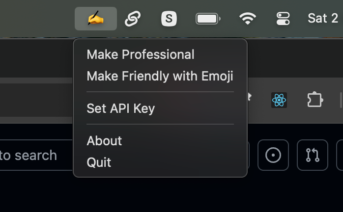

# Fix AI



Fix AI is a macOS application designed to enhance your writing using OpenAI's language model. It allows you to improve your text by making it more professional or friendly with emojis.

## Features

- **Text Enhancement**: Choose between two enhancement modes:
  - **Professional**: Makes the text more formal while maintaining its core meaning.
  - **Friendly with Emoji**: Makes the text more casual and friendly, adding appropriate emojis.
- **API Key Management**: Easily set and save your OpenAI API key.
- **User-Friendly Interface**: Simple menu-driven interface for quick access to features.

## Requirements

- macOS
- Python 3.x
- Required Python packages:
  - `rumps`
  - `openai`
  - `pyperclip`
  - `pyinstaller`

## Installation

There are two ways to build and install Fix AI:

### Method 1: Using PyInstaller (Recommended)

1. Clone the repository:
   ```bash
   git clone <repository-url>
   cd <repository-directory>
   ```

2. Install the required packages:
   ```bash
   pip install -r requirements.txt
   ```

3. Build the application using PyInstaller:
   ```bash
   pyinstaller "Fix AI.spec"
   ```

4. After building, you can find the application in the `dist` directory.

### Method 2: Using py2app (Alternative)

1. Clone the repository:
   ```bash
   git clone <repository-url>
   cd <repository-directory>
   ```

2. Install the required packages:
   ```bash
   pip install -r requirements.txt
   ```

3. Set up the application:
   ```bash
   python setup.py py2app
   ```

4. After building, you can find the application in the `dist` directory.

## Usage

1. Launch the Fix AI application.
2. Select the text you want to enhance.
3. Click on the desired enhancement option from the menu.
4. If prompted, enter your OpenAI API key.
5. The enhanced text will be automatically copied to your clipboard.

## Building from Source

The application can be built using the included spec file:

```bash
pyinstaller --windowed --name="Fix AI" --icon=app.iconset/FixAI.icns fix_ai.py
```

Or simply:
```bash
pyinstaller "Fix AI.spec"
```

## License

This project is licensed under the MIT License. See the LICENSE file for details.

## Acknowledgments

- Made by Adjie Purbojati
- Powered by OpenAI's language model
